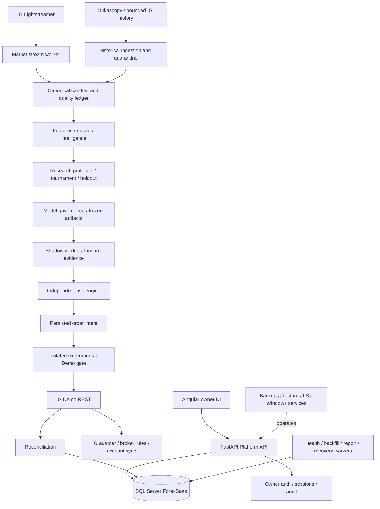

# Aurex Holistic Audit — 2026-09-10

Audit basis: repository inspection at commit `98b5cef73b0e3a2ca615cfc44827bb75fd9b50fb`, the current-status section of `docs/IMPLEMENTATION-PLAN.md`, source/configuration review, and a non-mutating workspace inventory. No broker order, migration, service restart, database write, or destructive operation was performed. Runtime assertions that require local administrator, SQL Server, IG, IIS, or service-manager access are explicitly marked `NOT_VERIFIABLE`.

## A. Executive summary

`AUREX_OVERALL_STATUS = GOVERNED RESEARCH PLATFORM; NOT READY FOR DEMO AUTO OR LIVE`.

The codebase implements a substantial owner-only Angular/FastAPI/SQL Server platform with IG Demo adapters, market streaming, historical/research pipelines, shadow controls, reconciliation, risk gates, provenance, backups, and an isolated experimental-demo path. The current governance posture is correctly conservative: no validated model is reported in the authoritative plan, demo execution is disabled by default, live trading is rejected by configuration, and no evidence in this workspace authorizes an order.

The critical path is evidence-dependent, not service-dependent. The plan records nine unresolved recent market gaps, current IG unreachability for corrected retries, rejected model candidates, insufficient Germany 40 V4 development/holdout floors, and incomplete recovery/security/runtime evidence. The safe current stage is `STAGE_1_RESEARCH`, with shadow infrastructure implemented but model-governed shadow promotion unavailable.

| Control | Current judgement |
|---|---|
| `TRADING_NOW` | NO evidence of trading; live path disabled |
| `VALIDATED_MODELS` | `0/4` per current authoritative plan |
| `SHADOW_READY` | Infrastructure: YES; model: NO; active governed shadow: NO |
| `EXPERIMENTAL_DEMO_READY` | NO — feature flag disabled/no armed programme |
| `DEMO_CANARY_READY` | NO |
| `DEMO_AUTO_READY` | NO |
| `LIVE_READY` | NO |
| `RISK_ENGINE_READY` | YES for fail-closed controls; live operational verification unavailable |
| `BROKER_RULES_READY` | PARTIAL — implementation exists; current runtime evidence unavailable and historical authority is not complete |
| `DATA_READY` | PARTIAL — Tier 1 quality is governed, but gaps/provider boundaries remain |
| `WEB_READY` | PARTIAL — Angular source/build exists; deployed SSR/service health not verified |
| `SECURITY_POSTURE` | MODERATE — strong safety design, incomplete production hardening evidence |

## B. Executive scorecard

Scores reflect implementation evidence, not arbitrary completion percentages.

| Area | Score | Justification |
|---|---:|---|
| DevOps | 58 | Service/install/recovery scripts exist; live service state and restart history unverified |
| Software Engineering | 76 | Clear modules, typed settings, tests and idempotency patterns; suite not runnable here |
| Architecture | 78 | Layering and fail-closed boundaries are explicit; single-host coupling remains |
| Database | 72 | 52-migration lineage, checksums and audit schemas; applied schema/drift not verified |
| Data Quality | 61 | Provenance, quarantine and validation exist; unresolved IG gaps and provider limits remain |
| ML/Research | 55 | Tournament/holdout/cost-aware governance exists; `0/4` validated |
| Trading | 35 | Shadow intent lifecycle exists; no evidence of governed executable readiness |
| Risk | 82 | Independent risk decisions and hard blockers are well represented; runtime proof outstanding |
| Security | 64 | Lockout, CSRF/CORS controls and secret guidance exist; MFA/HTTPS/pepper production proof missing |
| Broker Integration | 60 | IG Demo client/rule sync/reconciliation implemented; current authority evidence incomplete |
| Reconciliation | 76 | Unknown positions and submission uncertainty are blocking states; operational readback unavailable |
| Shadow | 58 | Worker and forward-evidence paths exist; no validated model and quality IntegrityError remain |
| Demo Readiness | 20 | Explicitly disabled and governance-blocked |
| Web/Product | 63 | Owner dashboard and readiness APIs exist; deployed artifact/service state unverified |
| Financial Governance | 62 | Cost-aware policy and native-currency protection exist; no live economics evidence |
| Documentation | 80 | Extensive implementation and operational records; current audit/runtime evidence needs closure |
| Operational Resilience | 52 | Backup/restore/recovery scripts exist; worker-kill result and task/service evidence absent |

## C. Evidence matrix

| Finding | Status | Evidence | File/table/API/log/service | Timestamp | Confidence |
|---|---|---|---|---|---|
| Owner-only localhost architecture is implemented | `CONFIRMED` | Angular, FastAPI and SQL boundaries are documented and present | `docs/IMPLEMENTATION-PLAN.md`, `apps/web`, `services/platform-api`, `database/scripts` | 2026-09-10 inspection | High |
| Live trading is disabled by configuration contract | `CONFIRMED` | Example config sets `TRADING_MODE=disabled`, `ALLOW_LIVE_TRADING=false` | `services/platform-api/.env.example`, `app/config.py` | 2026-09-10 | High |
| Experimental Demo is not enabled | `CONFIRMED` | `EXPERIMENTAL_DEMO_ENABLED=false`; plan says no programme armed | `.env.example`, implementation plan | 2026-09-10 | High |
| Validated models are zero of four | `CONFIRMED` | Authoritative current-status section says approval remains `0/4` | `docs/IMPLEMENTATION-PLAN.md` | 2026-09-10 | High |
| Current IG historical recovery has unresolved gaps | `CONFIRMED` | Plan records nine unresolved gaps and IG unreachability | `docs/IMPLEMENTATION-PLAN.md` | 2026-09-01 status carried forward | High |
| Germany 40 V4 is below data floors | `CONFIRMED` | 1,920 development and 472 holdout rows versus 2,000/500 floors | `docs/IMPLEMENTATION-PLAN.md` | 2026-09-01 status carried forward | High |
| Fail-closed order uncertainty exists | `CONFIRMED` | Unknown submission and reconciliation mismatch circuit-breaker states are implemented | `app/experimental_demo.py`, `app/trading_controls.py`, tests | 2026-09-10 | High |
| Migrations through 052 are present in repository | `CONFIRMED` | SQL scripts enumerate through `052_remove_daily_profit_quota_author.sql` | `database/scripts` | 2026-09-10 | High |
| Migration 052 removes daily-profit quota authority | `CONFIRMED` | Migration comment and risk-ledger tests define gains as outcomes, not entry quotas | `database/scripts/052...`, `tests/test_profit_quota_policy.py` | 2026-09-10 | High |
| Windows service state/recovery is healthy | `NOT_VERIFIABLE` | Scripts exist, but no service-manager output was available | `scripts/install_*`, `service_recovery_status.ps1` | 2026-09-10 | Low |
| SQL latest migration is applied and schema is drift-free | `NOT_VERIFIABLE` | No SQL connection/result supplied by workspace inspection | `app.schema_migrations` intended by runner | 2026-09-10 | Low |
| Backend regression suite passes | `NOT_VERIFIABLE` | `pytest` executable unavailable in this environment; no result claimed | `services/platform-api/tests` (51 test files) | 2026-09-10 | Low |
| Deployed SSR artifact is healthy | `PARTIALLY_CONFIRMED` | `dist` exists and package references `dist/web/server/server.mjs`; artifact contents/service state not inspected | `apps/web/package.json`, `apps/web/scripts/install_web_service.ps1` | 2026-09-10 | Medium |

## D. Architecture map



## E. Market readiness matrix

The plan explicitly names Tier 1 EUR/USD, GBP/USD, USD/JPY and Germany 40; the later registry also names GBP/JPY, EUR/JPY, AUD/JPY and USD/ZAR as research expansion markets, with Gold expected by the audit brief. Exact row counts and freshness are not independently verifiable here.

| Market | Live/history | Quality | Research | Model | Broker authority | Shadow/Demo | Primary blocker |
|---|---|---|---|---|---|---|---|
| EUR/USD | Implemented / partial evidence | Governed, runtime unverified | Eligible subject to gates | REJECTED/no validated | Implemented, current evidence unverified | Blocked | model + forward evidence |
| GBP/USD | Implemented / partial evidence | Governed, runtime unverified | Eligible subject to gates | REJECTED/no validated | Implemented, current evidence unverified | Blocked | model + forward evidence |
| USD/JPY | Implemented / partial evidence | Governed, runtime unverified | Eligible subject to gates | REJECTED/no validated | Implemented, current evidence unverified | Blocked | model + forward evidence |
| Germany 40 | Live adapter; Dukascopy proxy boundary | INCONCLUSIVE | Blocked by V4 floors/lineage | No validated | Implemented but authority evidence incomplete | Blocked | 1,920/472 floors; proxy equivalence |
| Gold | Registry/audit scope present; runtime unverified | NOT_VERIFIABLE | NOT_VERIFIABLE | NOT_VERIFIABLE | NOT_VERIFIABLE | Blocked | no independent runtime evidence |
| GBP/JPY, EUR/JPY, AUD/JPY, USD/ZAR | Tier 2/3 registry scope | NOT_VERIFIABLE | Research-only policy | No validated evidence | No execution authority claimed | Blocked | evidence and tier policy |

## F. Model matrix

| Candidate set | Result | Reason |
|---|---|---|
| Four enabled Tier 1 markets | `REJECTED` / `0/4 VALIDATED` | Current plan states cost-aware chronological candidates were rejected; exact per-model metrics require DB/artifact inspection |
| Germany 40 V4 lineage | `REJECTED` before fitting/holdout consumption | Insufficient target-eligible development and causal holdout rows |
| Legacy artifacts | `REGISTERED`, not validated | Original validation evidence unavailable |

No model is promotable on the available evidence. The system correctly requires chronological development, untouched holdout, immutable provenance, cost-aware metrics, and frozen forward shadow before any execution authority.

## G. Data lineage matrix

| Stage | Evidence-backed implementation |
|---|---|
| Source | IG Lightstreamer/REST and mapped Dukascopy files |
| Ingestion | Historical import, bounded recovery, quarantine and audit ledgers |
| Storage | Canonical M1/M5/M15 SQL schemas and migrations |
| Derived data | M1/M5 reconciliation and M15 aggregation |
| Features | Market and macro/intelligence modules |
| Model | Chronological tournament, calibrated artifacts and model versions |
| Decision | Signals, independent risk decisions and persisted intents |
| Outcome | Shadow/forward evidence, experimental Demo attempt, broker reconciliation |

Provider lineage is preserved in design. Historical proxy data is not execution-authoritative without explicit evidence.

## H. Risk register

| Priority | Risk | Probability/impact | Detection | Mitigation | Owner | Dependency |
|---|---|---|---|---|---|---|
| P0 | Accidental unsafe broker submission | Low / critical | Unknown-submission and mode gates | Keep live false, Demo flag false, verify one-shot/idempotency | Owner + engineering | Runtime control verification |
| P1 | Model overfit or cost failure | High / high | Holdout, walk-forward, cost stress | Preserve rejection; rebuild only from qualified data | Quant lead | Data quality |
| P1 | IG gap/reachability causes stale or incomplete prices | High / high | Freshness/gap ledgers | Restore IG connectivity and close exact gaps | SRE/data lead | IG availability |
| P1 | Broker rule increment/authority mismatch | Medium / high | Rule provenance and sizing rejection | Capture current IG evidence per instrument | Broker integration | IG session |
| P1 | Recovery failure after worker/process loss | Unknown / high | Worker-kill test and heartbeats | Execute safe non-trading recovery test; configure restart policy | SRE | Admin access |
| P1 | Production security hardening incomplete | Medium / critical | Config/deployment audit | MFA, HTTPS, secure cookies, pepper, secret manager, least privilege | Security owner | Deployment |
| P2 | Germany 40 proxy non-equivalence | Medium / high | Quantitative overlap study | Keep research-only until equivalence/lineage decision | Quant/data lead | Overlap data |
| P2 | SQL deadlocks / shadow IntegrityError | Unknown / medium | SQL logs and reproducible tests | Reproduce, narrow transactions, add constraints/index review | DB lead | SQL runtime |
| P2 | Single-host operational bottleneck | High / medium | Resource/process monitoring | Capacity plan and service isolation | Architecture | Usage evidence |

## I. Technical debt register

| Priority | Debt | Consequence |
|---|---|---|
| P1 | Runtime evidence is not captured as a signed/current audit bundle | Claims cannot be independently rechecked |
| P1 | Service/IIS/SQL state verification depends on manual administrator scripts | Recovery and deployment health are opaque |
| P2 | Test environment dependency installation is not reproducible in this workspace | Regression verification is delayed |
| P2 | Single-server SQL Express and Windows-service topology | Scaling and failure isolation are limited |
| P2 | Mixed historical providers and market-specific boundaries | Research comparability and lineage interpretation are harder |
| P3 | Broad implementation-plan history coexists with current status | Readers may confuse historical completion with readiness |

## J. Remediation backlog

1. **P0 / safety evidence:** Run `verify_controls.py`, `verify_governance.py`, and authenticated readiness checks against the configured Demo environment; DoD is archived output proving live disabled, Demo disabled, unknown submissions zero, and no armed programme. Blocks trading: yes.
2. **P1 / runtime:** Capture Windows service inventory, startup/recovery configuration, logs, IIS bindings, SSR artifact checksum, and a safe worker-kill/restart test. DoD is a timestamped evidence bundle with successful recovery. Blocks trading: yes.
3. **P1 / database:** Verify applied migrations/checksums, schema drift, deadlocks, indexes, and the shadow-quality `IntegrityError` root cause. DoD is a reproducible clean verification and tested remediation. Blocks trading: yes if unresolved.
4. **P1 / market data:** Restore IG reachability, retry the nine exact gaps, and independently record M1/M5/M15 completeness/freshness per market. DoD is quality-validated execution windows with no unexpected gaps. Blocks trading: yes.
5. **P1 / broker:** Refresh authoritative rules and preserve evidence for min size, increments, stops, margin and costs for every canary instrument. DoD is four or more current broker-rule records with provenance. Blocks trading: yes.
6. **P1 / quant:** Re-run research only on qualified lineages; use untouched holdout, cost stress and stability gates. DoD is at least one frozen validated candidate with complete metrics. Blocks trading: yes.
7. **P1 / shadow:** Approve only a frozen candidate, collect policy-required forward shadow, and verify restart/reconciliation behavior. DoD is passed forward-shadow policy with immutable evidence. Blocks trading: yes.
8. **P1 / security:** Before any public-domain deployment, set real hash pepper, MFA, HTTPS, secure cookies, secret storage, least-privilege SQL and dependency review. DoD is configuration and deployment evidence without secret exposure. Blocks trading/public deployment: yes.
9. **P2 / Germany 40:** Complete overlap return/candle/session/gap equivalence study; DoD is PASS or a documented continued research-only decision. Blocks trading: for Germany 40, yes.
10. **P2 / product:** Ensure every UI readiness indicator maps to backend evidence and exposes blocker reason/timestamp. DoD is owner can answer health/trading/blocker questions in under 60 seconds. Blocks trading: no, but blocks governance usability.

## CRITICAL PATH TO FIRST GOVERNED DEMO TRADE

1. Prove operational safety, database integrity, service recovery, and no-unknown-submission state.
2. Restore IG reachability; close and validate exact current-data gaps; refresh authoritative broker rules.
3. Produce a qualified lineage and a cost-aware model that passes unchanged holdout gates; freeze it.
4. Accumulate and pass forward-shadow evidence with reconciliation and recovery tests.
5. Obtain explicit owner approval, enable the isolated Demo programme, arm one minimum-risk canary, and verify post-trade reconciliation. Any failure remains fail-closed.

## 30/60/90-day roadmap

### Next 7 days

Close runtime evidence gaps, reproduce the SQL/shadow IntegrityError, restore IG history recovery, verify services and worker recovery, and keep all execution flags disabled.

### 30 days

Complete qualified data windows, broker-rule authority, Germany 40 decision, and repeatable model-research/holdout reporting. Begin forward shadow only if a model passes governance.

### 60 days

Accumulate governed forward evidence, harden monitoring/backups/restore, close security prerequisites, and establish a second independent candidate only if data and statistics support it.

### 90 days

Assess whether isolated Demo Auto is justified from forward evidence, operational resilience, cost stress and owner governance. Do not schedule Live trading as a 90-day deliverable.

## WHAT I WOULD FIX FIRST

Close the current-data/IG reachability and runtime-evidence gaps, then resolve model validation and forward-shadow evidence in order.

## WHAT I WOULD NOT TOUCH YET

Live trading, third-party onboarding, SaaS expansion, aggressive UI polish, and additional markets without qualified data and an explicit tier decision.

## WHAT COULD BREAK AUREX

Treating fallback/proxy data as execution-authoritative, weakening rejected-model gates, ambiguous broker submissions, stale account/rule state, and untested service/database recovery.

## WHAT MAKES AUREX STRONG

Fail-closed controls, explicit model/data provenance, independent risk decisions, idempotent order intent/reconciliation design, owner-only scope, and deliberate separation of research, shadow, Demo and Live stages.

## NEXT GOVERNANCE GATE

Evidence gate: operational recovery + current canonical data + authoritative broker rules + one frozen validated model + forward-shadow policy pass.

## GO / NO-GO DECISION

`NO-GO for Demo Auto and Live; current stage = STAGE_1_RESEARCH.` The repository and current plan support substantial platform/shadow infrastructure, but `0/4` validated models, unresolved data/recovery evidence, disabled experimental Demo, and unavailable runtime verification prevent safe progression.

## Console summary

```text
AUREX HOLISTIC AUDIT
====================
Audit date: 2026-09-10
Git commit: 98b5cef73b0e3a2ca615cfc44827bb75fd9b50fb
Environment: repository inspection; runtime/database/service state not verified

Overall status: governed research platform; not ready for Demo Auto or Live
Current stage: STAGE_1_RESEARCH

Platform: implemented / runtime unverified
Database: migrations present / applied state unverified
Streaming: implemented / runtime unverified
Data: partial; IG gaps and lineage blockers remain
Macro intelligence: implemented research-only boundary
Models: 0/4 validated
Shadow: infrastructure present; model-blocked
Risk: fail-closed controls implemented
Broker rules: partial / current authority unverified
Reconciliation: implemented / runtime unverified
Web: source and dist present / deployed health unverified
Security: MODERATE
Financial governance: NO pending evidence closure

Validated models: 0/4

Experimental Demo Ready: NO
Demo Canary Ready: NO
Demo Auto Ready: NO
Live Ready: NO

P0 blockers: unsafe-submission evidence must remain closed; no evidence of an active P0 incident
P1 blockers: IG gaps/reachability, zero validated models, broker authority, recovery/security evidence

Critical path:
1. Verify safety/runtime/database and recovery
2. Restore IG data and authoritative broker rules
3. Pass model/holdout gates and freeze candidate
4. Pass forward-shadow evidence
5. Owner-approved minimum-risk Demo Canary

Recommended next action: execute the runtime/database/IG evidence closure checklist
Audit report: docs/audits/AUREX_HOLISTIC_AUDIT_2026-09-10.md
```
